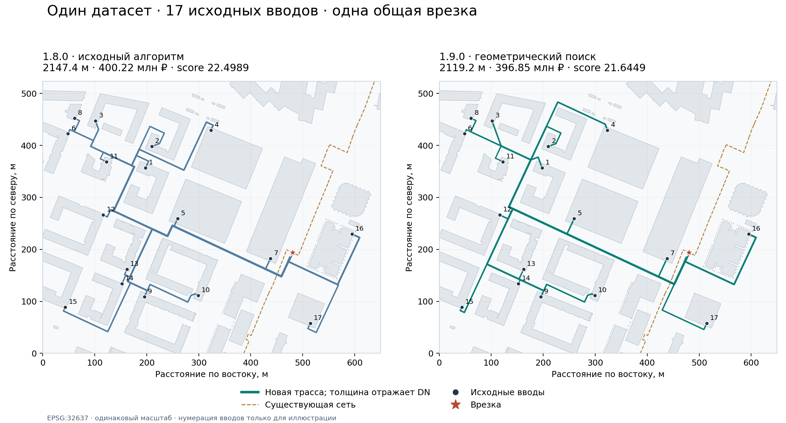

# Проверка GEOMETRY 1.9.0 — 23 сентября 2026

Реализован геометрический поиск общей сети на основе проекта TREE 1.8.0. Результат: все 17 исходных вводов подключены к одной общей врезке, score 21,644948. Исходники, интерфейс, готовый JAR и проверенный GeoJSON входят в сборку.

## Сопоставимый эксперимент

Сравниваются чистые запуски исходной 1.8.0 и новой 1.9.0 в одной среде Java 11, без начальной сохранённой сети. Все общие параметры совпадают: исходный `examples/supplied.geojson`, загрузка существующей сети 50%, `mode=depth`, профиль приложения, глубина 0,7–6 м, сетка 20 м, одна врезка, пять начальных мест, два прохода, восемь кандидатов для составных операций, перестройка развилок включена. Обучение и глубокая перестройка выключены. В 1.9.0 дополнительно включён новый геометрический поиск.

| Показатель | Исходная 1.8.0 | GEOMETRY 1.9.0 | Изменение |
|---|---:|---:|---:|
| Новая трасса, м | 2147,37 | 2119,17 | −28,20 м / −1,31% |
| Реконструкция, м | 316,89 | 316,89 | без изменения |
| Расчётная стоимость, млн ₽ | 400,218 | 396,849 | −3,369 / −0,84% |
| Score, меньше лучше | 22,498880 | 21,644948 | −3,80% |
| Изгибы внутри труб | 30 | 19 | −11 / −36,67% |
| Все повороты 90° / 45°, включая присоединения | 44 / 4 | 31 / 6 |  |
| Вводы | 17 из 17 | 17 из 17 | все сохранены |
| Врезки | 1 | 1 |  |
| Время расчёта, с | 86,70 | 170,68 | +83,98 с |

Более широкий поиск улучшил целевую оценку ценой большего времени. Это по одному запуску каждой версии; интервалы разброса времени не измерялись. Денежные значения — результат заданного каталога, не рыночная смета.



## Сопоставление с присланными отчётами

| Отчёт | Новая трасса, м | Стоимость, млн ₽ | Score |
|---|---:|---:|---:|
| 1.8.0, `64b13bee…` | 2100,63 | 395,980 | 21,864998 |
| 1.8.0, `303193c9…` | 2146,93 | 394,890 | 22,085632 |
| 1.9.0, новый чистый запуск | 2119,17 | 396,849 | 21,644948 |

Относительно лучшего score из присланных отчётов новая оценка ниже примерно на 1,01%. При этом трасса длиннее на 18,54 м и стоимость выше на 0,869 млн ₽, чем в `64b13bee…`: выигрыш общей оценки связан с меньшими штрафами поворотов. Новая версия не превосходит каждый прежний вариант по каждому показателю. В присланных отчётах включены обучение и глубокая перестройка, поэтому их длительность нельзя напрямую сравнивать с нашим чистым запуском.

## Что фактически сработало на этом наборе

Дополнительная модель исходных коридоров дала начальный score 22,093182. Геометрический поиск принял пять переподключений и одно совместное объединение поддеревьев; score стал 21,923925. Совместная перестройка соседних развилок приняла два изменения и снизила score до 21,803453. Заключительный проход принял ещё три переподключения и довёл score до 21,644948, удалив две ненужные камеры.

Минимальный остов метрического замыкания дал допустимые альтернативы, но не стал лучшим начальным решением этого эксперимента. Перенос врезки предусмотрен, однако в итоговом чистом запуске не дал принятого улучшения.

За обе геометрические стадии выполнено 92 полных оценки сетей и 2215 отсевов по нижней оценке. В перестройке соседних развилок — 41 полная оценка и 18054 отсева. Эти числа описывают один запуск, а не доказательство общего ускорения алгоритма. Из 320 запусков локального графового поиска 39 пропущены из-за ограничения размера; аналитические соединения и прежние допустимые сети сохранялись.

## Проверки

- `mvn package`: 167 обнаруженных тестов, 157 выполнены успешно, 10 условных длительных проверок пропущены по умолчанию; ошибок и падений нет.
- `TreeTrunkSuppliedTest` дополнительно запущен с `treeTrunkSupplied=true`: все 17 вводов и одна врезка во всех возвращённых вариантах.
- Семь новых обычных геометрических тестов проверяют сокращение извилистой трассы, сохранение исходной сети, отмену, обход препятствия, проход меньшего DN, направление врезки на изломе, связность метрического дерева и корректность нижней оценки на контрольных геометриях. Несколько свойств объединены в одном тесте.
- Независимый Python-валидатор выгруженного GeoJSON: три из трёх вариантов прошли проверки связности и отсутствия циклов, точных вводов, закреплённых стен, недопустимого транзита через 85 зданий, расстояний, пересечений, ссылок узлов, суммы стоимости и формулы score. Глубина итоговых вариантов — 2,05–3,00 м; проверен один переход через коммуникацию в каждом варианте.
- Chromium: запущен собранный JAR на Java 11 с H2 для тестирования; проверены версия сервера, переход со старого URL, `no-store`, новый переключатель, отображение настоящего отчёта и мобильная ширина 390 px. Ошибок JavaScript нет. В браузере отчёт подставлен для проверки отображения, сам большой расчёт выполнен отдельным Java-тестом.
- Совместимость Java 11 подтверждена major version 55 классов. SHA-256 JAR и исходников записаны в `release/manifest.json`.

Docker с PostgreSQL в этой среде не запускался. Большие городские наборы и файлы 3 ГБ не проверялись. Глобальная оптимальность, свободная пространственная трассировка и полный гидравлический расчёт не заявляются.

## Как воспроизвести

В корне распакованного проекта, Java 11 и Maven:

```bash
mvn -f server/pom.xml package
mvn -f server/pom.xml -Dtest=TreeTrunkSuppliedTest -DtreeTrunkSupplied=true -DskipTrunkRepair=true -DtrunkOutput=../validation/geometry-final test
python -m pip install -r validation/requirements-check.txt
python validation/verify_nearest_turns.py --output-name geometry-final/supplied-trunk --report-name geometry-final/independent-check.json
```

Для сравнения исходной версии выполнена та же команда теста из её отдельной распакованной копии. Результаты сохранены здесь как `baseline-1.8.0.geojson` и `baseline-1.8.0-report.json`. Точные настройки и показатели — `comparison.json`. Для повторного построения иллюстрации дополнительно установите matplotlib и запустите `plot_comparison.py`.

Полное описание постановки, изменений, исходников и ограничений: `docs/GEOMETRIC_ALGORITHM.md` в корне проекта. Команды запуска и обновления: `README.md`.
